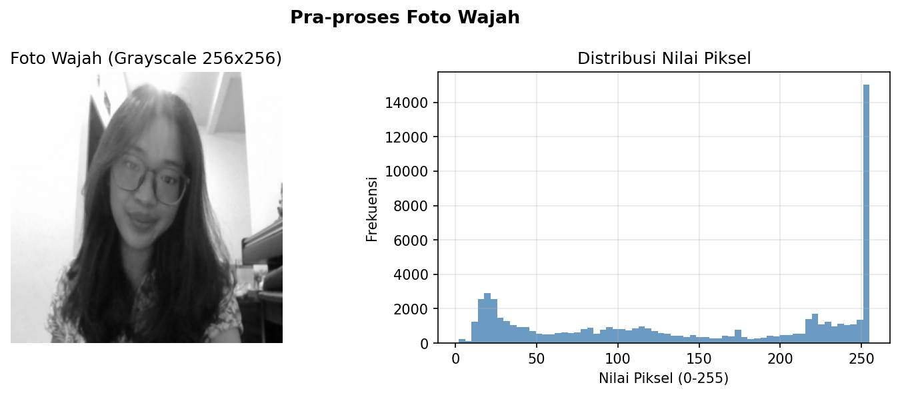
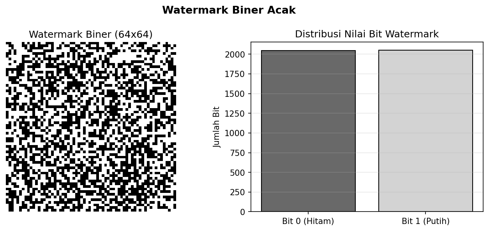
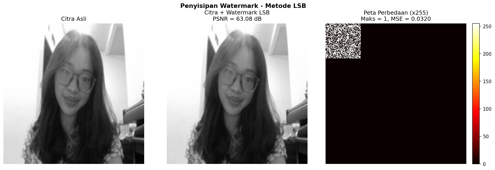
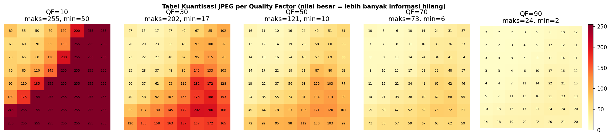
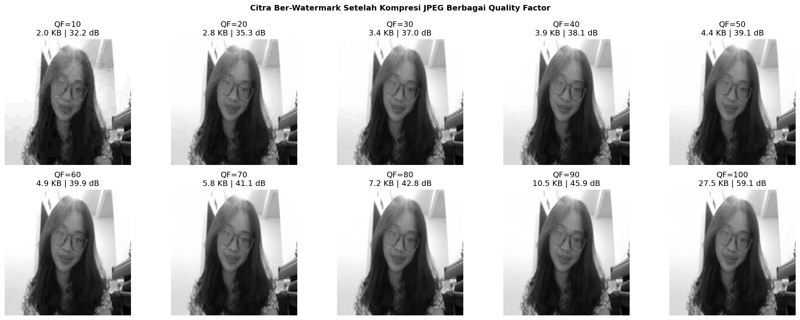
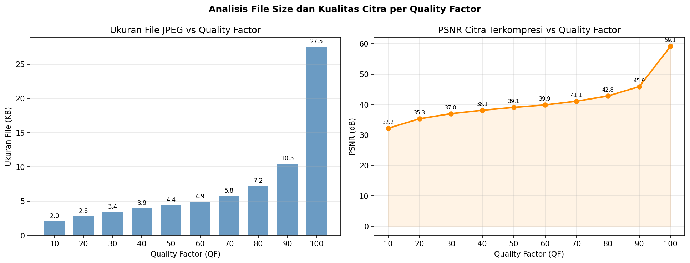
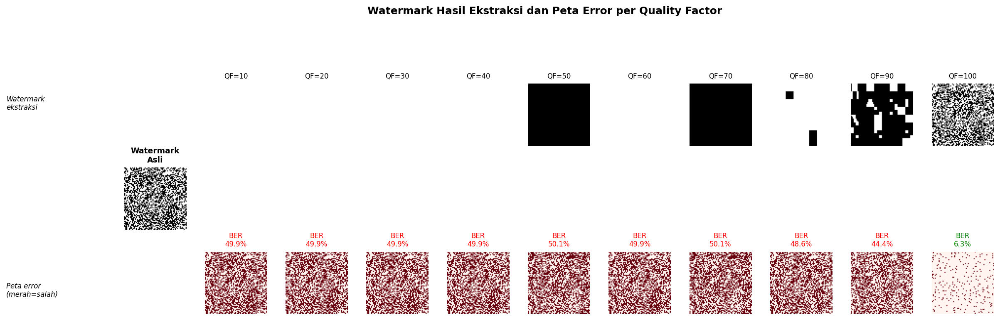
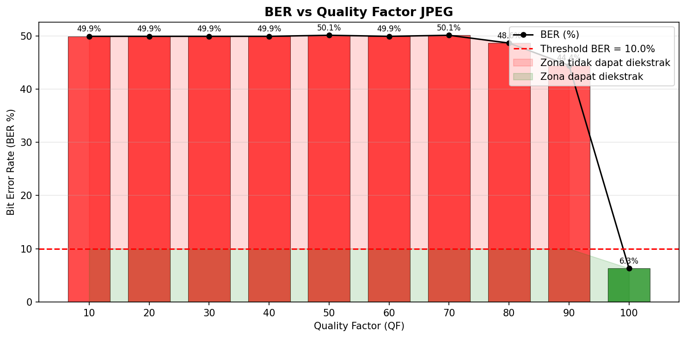
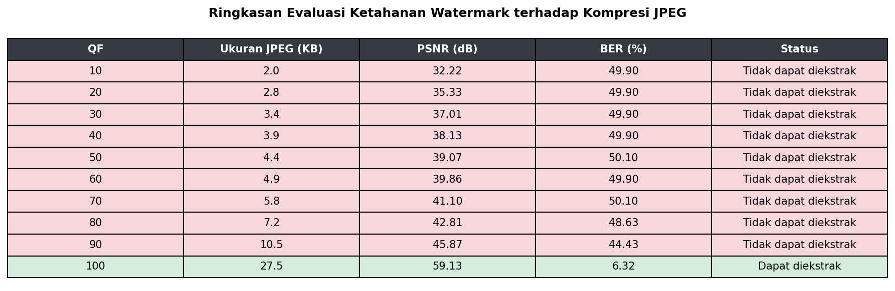

# Implementasi Digital Image Watermarking Menggunakan Metode LSB Spasial dan Analisis Robustness Terhadap Kompresi JPEG

Mata Kuliah: Sistem Multimedia  
Nama: M.B. Adyanti Narandita  
NIM: 18224026  

Project ini mengeksplorasi teknik digital image watermarking metode Least Significant Bit (LSB) pada domain spasial, serta menguji ketahanan watermark terhadap kompresi JPEG dengan variasi Quality Factor (QF). Algoritma Discrete Cosine Transform (DCT) diimplementasikan secara manual menggunakan operasi matriks NumPy tanpa library SciPy.

## Alur Kerja Jupyter Notebook per sel

### Step 1 dan 2: Memuat Library dan Membaca Gambar
Program memuat library NumPy, Matplotlib, dan Pillow, lalu membaca file foto asli untuk dikonversi menjadi gambar skala keabuan (grayscale).

  

### Step 3: Membuat Watermark Biner
Watermark biner berukuran 32 x 32 piksel dibuat secara acak dengan nilai murni 0 atau 1. Penguncian seed digunakan agar hasil matriks bersifat reproducible.

  

### Step 4: Penyisipan Watermark (Embedding)
Bit dari watermark rahasia disisipkan ke dalam bit terakhir (Least Significant Bit) dari setiap piksel gambar asli. Perubahan nilai piksel maksimal hanya sebesar 1 tingkat sehingga tidak terdeteksi oleh mata manusia.

  

### Step 5: Visualisasi Kuantisasi DCT
Proses internal kompresi JPEG disimulasikan per blok 8 x 8 piksel melalui transformasi frekuensi DCT dan pembulatan matriks kuantisasi untuk menunjukkan letak hilangnya bit LSB.

  

### Step 6: Simulasi Kompresi JPEG Lossy
Gambar ber-watermark disimpan ulang ke format JPEG dengan 10 variasi Quality Factor (QF 10 hingga QF 100) menggunakan memori buffer untuk mengukur ukuran file (KB) dan nilai PSNR.

  

  

### Step 7 dan 8: Ekstraksi Watermark dan Grafik BER
Watermark diekstrak kembali dari setiap gambar JPEG menggunakan operasi Modulo 2. Tingkat kerusakan bit dihitung menggunakan parameter Bit Error Rate (BER) lalu diplot ke dalam grafik garis terhadap nilai QF.

  

  

### Step 9: Tabel Ringkasan Data
Seluruh data hasil pengukuran metrik ukuran file, tingkat kemiripan gambar (PSNR), dan persentase kesalahan bit (BER) dirangkum dalam satu matriks tabel.

  

## Analisis

1. Kekurangan metode LSB: Metode penyisipan bit pada domain spasial LSB terbukti tidak tahan terhadap kompresi lossy JPEG. Kerapuhan ini ditunjukkan dengan nilai BER yang melonjak dari 0.0% pada QF 100 langsung menuju ke kisaran 50% pada QF 90 ke bawah. Nilai BER 50% mengindikasikan informasi watermark telah rusak total.

2. Efek kuantisasi kasar: Munculnya visualisasi kotak putih polos (pada QF 10 hingga 40, serta QF 60) dan kotak hitam polos (pada QF 50 dan QF 70) disebabkan oleh pembulatan nilai piksel secara masal oleh tabel kuantisasi JPEG dalam blok 8 x 8. Pembulatan ke angka ganjil seragam menghasilkan nilai biner 1 (putih), sedangkan pembulatan ke angka genap seragam menghasilkan nilai biner 0 (hitam) saat diekstrak menggunakan rumus modulo.

3. Pengaruh format gambar awal: Penggunaan file input awal berformat .jpg dari awal sangat memengaruhi hasil akhir eksperimen. File .jpg  telah mengalami kompresi lossy pertama dari sistem sebelumnya, sehingga variasi nilai piksel tetangga dalam blok 8 x 8 sudah cenderung rata. Ketika gambar ini disisipkan watermark lalu dikompresi kembali untuk kedua kalinya di dalam program, algoritma JPEG dengan sangat mudah menghilangkan seluruh variasi bit LSB yang tipis tersebut.
   
## Kesimpulan

Watermark LSB spasial hanya dapat dipulihkan secara utuh pada tingkat QF 100 di mana tidak terjadi kompresi lossy. Data watermark pada domain spasial LSB akan hilang jika dilewatkan pada proses kompresi berbasis algoritma kuantisasi frekuensi. Terdapat pengaruh dari format file inputan awal.
